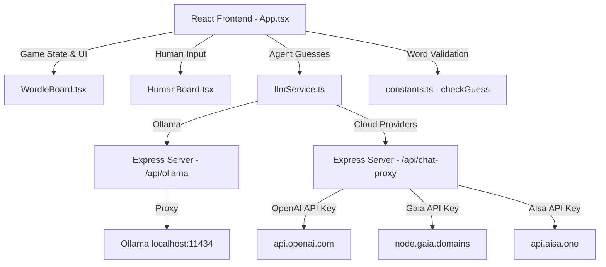

# Wordle Agent Duel 🤖 ⚔️ 🧑

**A competitive Wordle arena where AI agents — and you — race to solve a word puzzle.**

[](LICENSE)


---

## 🎯 What Is This?

Wordle Agent Duel is an open-source competitive Wordle solver that pits **two autonomous AI agents against each other** — and optionally against a **human player**. Each agent uses an LLM to reason through letter constraints, generate guesses, and race to solve a hidden 5-letter word in 6 attempts or less.

Watch the AI think in real-time through a sequential thought process display, track retries and errors, and see who cracks the code first.


## ✨ Features

| Feature | Description |
|---|---|
| 🤖 **Multi-Agent Duel** | Two AI agents solve Wordle simultaneously |
| 🧑 **Human vs AI Mode** | Play against both agents in a 3-column arena |
| 🧠 **Thought Process** | See each agent's sequential reasoning per guess |
| 🔄 **Retry Tracking** | Errors don't crash the game — agents retry and retries are counted |
| 🏆 **Winner Popup** | Animated modal with winner details and close option |
| 🔌 **Multi-Provider** | Ollama, OpenAI, Gaia, AIsa.one — mix and match |
| 📋 **Model Dropdown** | Auto-detects local Ollama models via dropdown |
| 🎨 **Premium UI** | Dark mode, glassmorphism, Framer Motion animations |

## 🏗️ Architecture



### How It Works

1. **Game Initialization**: A random 5-letter word is picked from the word list
2. **Agent Turn Loop**: Each agent calls `getNextGuess()` which:
   - Pre-computes constraints (correct positions, present letters, banned letters)
   - Injects them directly into the prompt so the LLM doesn't have to derive them
   - Parses the `<thinking>` and `<guess>` tags from the response
3. **Human Turn** (optional): The player types a guess in the input field
4. **Winner Detection**: First to match the target word triggers confetti + popup

### Prompt Engineering

The key innovation is **pre-computed constraint injection**. Instead of asking the LLM to interpret raw feedback, we compute the constraints server-side and inject them:

```typescript
// Pre-computed from guess history
const constraintBlock = `
  === CURRENT CONSTRAINTS (YOU MUST OBEY THESE) ===
  Known pattern: [ _ R A _ _ ]
  Letters that MUST appear: E
  Letters that are BANNED: H, O, U, S
  ================================================
`;
```

This dramatically improves accuracy for smaller local models that struggle with logical deduction from raw Wordle feedback.

## 🚀 Quick Start

### Prerequisites

- **Node.js 18+**
- **Ollama** (default): [ollama.com](https://ollama.com/) running locally

### Setup

```bash
# Clone the repo
git clone https://github.com/harishkotra/wordle-agent-duel.git
cd wordle-agent-duel

# Pull local models (for Ollama)
ollama pull llama3.2:latest
ollama pull qwen2.5vl:7b

# Install dependencies
npm install

# (Optional) Configure cloud providers
cp .env.example .env
# Edit .env and set your API keys

# Start the app
npm run dev
```

Visit **http://localhost:3000** and start the duel!

## 🔌 Provider Setup

The app supports 4 AI providers out of the box. Set API keys in your `.env` file:

| Provider | Env Variable | Default Base URL | Notes |
|---|---|---|---|
| **Ollama** (default) | None needed | `localhost:11434` | Must be running locally |
| **OpenAI** | `OPENAI_API_KEY` | `api.openai.com` | [Get key](https://platform.openai.com/api-keys) |
| **Gaia** | `GAIA_API_KEY` | `llama3b.gaia.domains` | Custom node URL supported |
| **AIsa.one** | `AISA_API_KEY` | `api.aisa.one` | [Get key](https://aisa.one) |

You can **mix providers** — e.g., Agent Alpha on OpenAI GPT-4o vs Agent Beta on local Llama 3.2.

## 🛠️ Tech Stack

| Layer | Technology |
|---|---|
| **Frontend** | React 19, TypeScript, Tailwind CSS 4 |
| **Animations** | Framer Motion (motion/react) |
| **Icons** | Lucide React |
| **Server** | Express.js with Vite middleware |
| **LLM Proxy** | Custom Express routes for Ollama + OpenAI-compatible APIs |
| **Build** | Vite 6 |
| **Runtime** | tsx (TypeScript execution) |

## 📁 Project Structure

```
wordle-agent-duel/
├── server.ts              # Express server with API proxy routes
├── src/
│   ├── App.tsx            # Main app with game logic & state
│   ├── constants.ts       # Word list & checkGuess algorithm
│   ├── services/
│   │   └── llmService.ts  # LLM prompt engineering & API calls
│   └── components/
│       ├── WordleBoard.tsx # Agent Wordle board with thoughts
│       └── HumanBoard.tsx # Human interactive board
├── .env.example           # API key template
├── vite.config.ts         # Vite + Tailwind config
└── package.json
```

## 🤝 Contributing

Contributions are welcome! Here's how to get started:

1. **Fork** the repository
2. **Create** a feature branch: `git checkout -b feature/my-feature`
3. **Commit** your changes: `git commit -m 'Add my feature'`
4. **Push** to the branch: `git push origin feature/my-feature`
5. **Open** a Pull Request

### Feature Ideas for Contributors

Here are some features that would make great contributions:

| Feature | Difficulty | Description |
|---|---|---|
| 🏆 **Leaderboard** | 🟢 Easy | Track win/loss stats per model across sessions (use localStorage) |
| 📊 **Analytics Dashboard** | 🟡 Medium | Show charts of guess distribution, avg retries per model, win rates |
| 🎮 **Tournament Mode** | 🟡 Medium | Best-of-N rounds with cumulative scoring |
| 🌐 **Multiplayer** | 🔴 Hard | WebSocket-based live duels between remote players |
| 🧩 **Custom Word Lists** | 🟢 Easy | Let users upload or pick themed word lists |
| 📱 **Mobile Layout** | 🟡 Medium | Responsive stacked layout for mobile devices |
| 🔊 **Sound Effects** | 🟢 Easy | Add audio feedback for correct/present/absent reveals |
| 🧪 **Model Benchmark** | 🔴 Hard | Run 100 words against each model and generate accuracy reports |
| 🎨 **Theme System** | 🟢 Easy | Light mode, custom color schemes, high contrast |
| 🔐 **In-App API Key Entry** | 🟡 Medium | Let users paste API keys in the UI instead of `.env` |

### Development Commands

```bash
npm run dev      # Start dev server with HMR
npm run build    # Production build
npm run lint     # TypeScript type checking
npm run preview  # Preview production build
```

## 📄 License

MIT — use it, fork it, build something cool!
